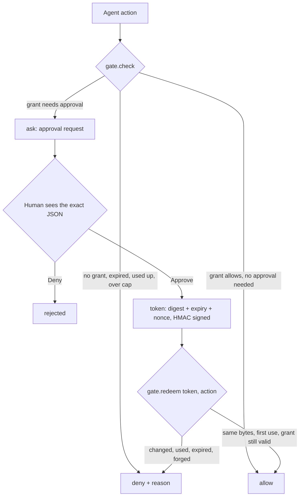
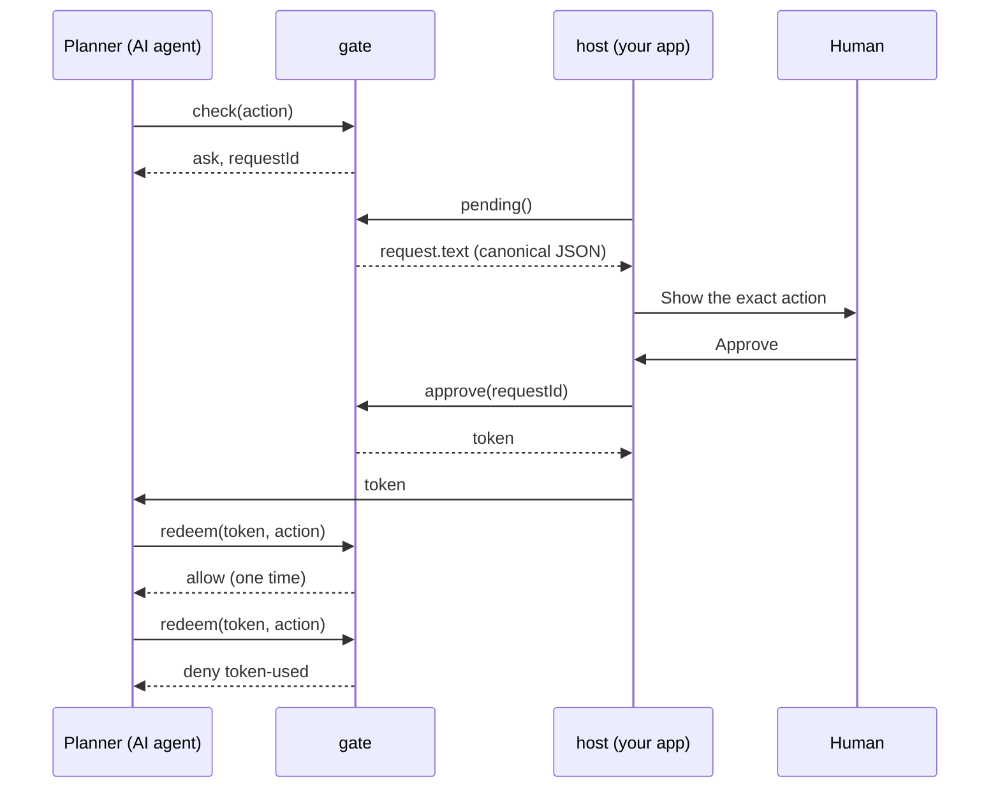
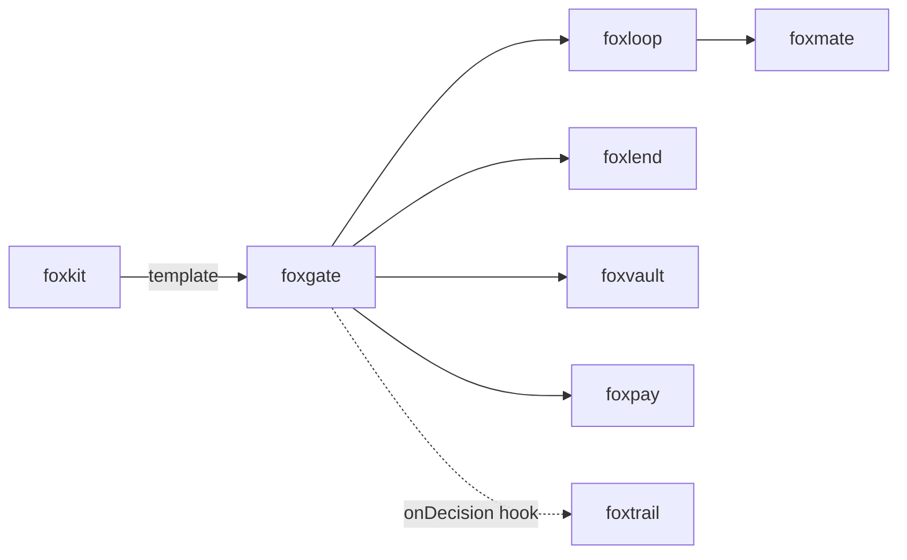

# foxgate

<p align="center">Policy, exact-action approvals, and spend caps for AI agents.</p>

<p align="center">
  <a href="https://github.com/pooriaarab/foxgate/actions"></a>
  <a href="LICENSE"></a>
</p>

foxgate stands between an AI agent and the actions it wants to do. Your app
adds grants. The agent asks before each action. foxgate answers `allow`,
`deny`, or `ask`. When it asks, a human approves one exact action, and the
token works for that action only, one time. The core is plain TypeScript with
no browser dependency. It runs in Node 24+ and in a Firefox extension.

## Install

```bash
npm i foxgate
```

## Example

```js
import { createFoxgate } from "foxgate";

// Your app registers the tools and keeps `host`. The AI planner gets only `gate`.
const tools = { checkout: { scope: "pay", amount: (args) => ({ value: args.total, currency: "USD" }) } };
const { gate, host } = createFoxgate({ tools });
await host.addGrant({ scope: "pay", domains: ["shop.example.com"], spendCap: { value: 5000, currency: "USD" } });

const action = { tool: "checkout", args: { cart: "c-42", total: 1999 }, domain: "shop.example.com", scope: "pay" };
const asked = await gate.check(action);
console.log(asked.decision); // "ask"

const [request] = await host.pending();
console.log(request.text); // the exact JSON that the human approves
const token = await host.approve(asked.requestId);

const changed = { ...action, args: { cart: "c-42", total: 4999 } };
console.log((await gate.redeem(token, changed)).reason); // "action-changed"
const token2 = await host.approve((await gate.check(action)).requestId);
console.log((await gate.redeem(token2, action)).decision); // "allow"
console.log((await gate.redeem(token2, action)).reason); // "token-used"
```

## Use cases

| Who | What they build | How foxgate helps |
|---|---|---|
| A browser agent author (for example foxmate) | An agent that fills and submits forms in the user's own browser | Reading and filling run on grants. Submitting and paying stop for a human, who sees the exact JSON. |
| An MCP server author | Tools that send email, open pull requests, or delete files | The server calls `gate.check` before each tool call and returns the request to the client for approval. |
| A team that runs CI bots | A bot that buys test devices or cloud credits | A `pay` grant with `approval: "never"`, a `spendCap`, and `maxUses`. All jobs call one gate, for example in one small service. Then the bot cannot spend past the cap, also when two jobs ask at the same time. |
| A QA engineer | Browser automation that runs against staging sites | Exact-host grants keep the scripts on the staging hosts. `evil-staging.com` does not match `staging.com`. |
| A developer on any agent framework | A LangChain, Vercel AI SDK, or custom tool loop | Wrap each tool in `check`, and in `redeem` when the answer is `ask`. Deny is the default, so a new tool is blocked until the host registers it with its scope and a grant covers it. |
| An audit log author (for example foxtrail) | A tamper-evident record of agent decisions | The `onDecision` hook gets every decision before it takes effect. If the hook throws, the answer is `deny`. |

## How it works



1. `check` looks up the tool in the host tool registry. An unknown tool, or a
   scope or amount that differs from the registry, gets `deny`. The amount
   comes from the host function for that tool, not from the planner.
2. It normalizes the action. It turns the domain into lowercase punycode and
   writes the action as canonical JSON (sorted keys).
3. It finds a grant with the same scope, a matching domain, and the tool.
4. It refuses the action when the grant has expired, has no uses left, or the
   amount takes it over its spend cap. It does not ask a human about an action
   that cannot run.
5. For a grant that needs approval, it stores a request with the canonical
   text and its SHA-256 digest.
6. `approve` signs a token with an HMAC-SHA256 key that JavaScript cannot
   export. The token holds the digest, an expiry time, and a one-time nonce.
7. `redeem` checks the signature, the expiry, and the nonce. It uses the token
   up, then compares the digest and checks the grant again.



All state changes in one gate run one at a time, so two actions cannot pass a
cap together. This holds for one gate only, so use one gate for each store.
foxgate stores the latest time it saw, so a clock that goes back cannot make
an expired grant or token valid again. It stores valid nonces, not used ones,
so lost storage makes tokens invalid. Every failure mode has a test: see [docs/failure-modes.md](docs/failure-modes.md).

## API

This package is a library only. It has no CLI and no MCP server. A policy
check depends on stored state (uses, spend, waiting requests) and on a key
that lives in one process. A one-shot command cannot keep either, so a CLI
would show answers that differ from the real gate.

### `createFoxgate(options)`

Returns `{ gate, host }`. Both objects are frozen.

| Option | Default | What it does |
|---|---|---|
| `tools` | required | `{ name: scope }` or `{ name: { scope, amount } }`. Every tool the planner may use. `amount(args)` returns `{ value, currency }`, and a `pay` tool needs it. |
| `store` | `memoryStore()` | Where grants, requests, and spend live. |
| `now` | `Date.now` | The clock, in ms since 1970. If it returns a value that is not a finite number, `check` and `redeem` give `deny` `clock-error`. |
| `publicSuffix` | none | `{ getDomain(host) }`. Needed for `*.` patterns. In Firefox 153+, pass `browser.publicSuffix`. |
| `onDecision` | none | `(event) => void \| Promise<void>`. Runs before each decision takes effect. If it throws, the answer is `deny` `hook-failed`. |
| `key` | a new key | A non-exportable HMAC SHA-256 `CryptoKey` with the usages `sign` and `verify`. |
| `requestTtlMs` | 10 minutes | How long a request waits for a human. |
| `tokenTtlMs` | 2 minutes | How long a token is valid. |
| `maxPending` | 20 | The most requests that can wait at one time. |

### `gate` (give this to the planner)

| Method | Returns |
|---|---|
| `check(action)` | `allow` with the normalized `action` (and counts one use and the amount), `ask` with a `requestId`, or `deny` with a `reason`. |
| `redeem(token, action)` | `allow` with the normalized `action` (and counts one use and the amount), or `deny`. Any try uses the token up. |

An action is `{ tool, args, domain, scope, amount? }`. `scope` is `read`,
`fill`, `submit`, or `pay`, and it must be the scope that the host registered
for the tool. `args` is a JSON object. `amount` is `{ value, currency }` in
whole minor units (cents). You can leave it out: foxgate takes the amount
from the host function for the tool. A different amount gives `deny`
`wrong-amount`. Any other field gives `deny` `bad-action`.

When the answer is `allow`, run `decision.action`, not your own copy. It is
the action that foxgate judged: the domain in punycode, the args as plain
JSON, and the amount from the host function.

### `host` (keep this away from the planner)

| Method | What it does |
|---|---|
| `addGrant(grant)` | Adds a grant and returns it with its `id`. Throws a `FoxgateError` for a bad grant. |
| `revokeGrant(id)` | Removes the grant and its waiting requests. |
| `grants()` | All grants, with `uses` and `spent`. |
| `pending()` | Requests that wait for a human. `text` is the canonical JSON to show. |
| `approve(requestId)` | Returns a token for that exact action. |
| `reject(requestId)` | The same action gets `deny` `rejected` until the request expires. |

A grant is `{ scope, domains, tools?, spendCap?, expiresAt?, maxUses?, approval? }`.
A domain is an exact host (`shop.example.com`) or `*.` plus a host for its
subdomains only. `approval` is `"always"` or `"never"`. The default is
`"always"` for `submit` and `pay`, and `"never"` for `read` and `fill`.

### Deny reasons

`bad-action`, `unknown-tool`, `wrong-scope`, `wrong-amount`, `no-grant`, `expired`, `used-up`, `spend-cap`, `currency`,
`too-many-requests`, `bad-token`, `token-expired`, `token-used`,
`action-changed`, `rejected`, `hook-failed`, `storage-error`, `clock-error`.

### Other exports

| Export | What it does |
|---|---|
| `memoryStore()` | Storage in memory. |
| `storageAreaStore(area)` | Storage in a WebExtension area, for example `browser.storage.local`. |
| `canonicalJson(value)` | Sorted-key JSON. Throws for values that JSON cannot hold exactly. |
| `normalizeHost(host)` | Lowercase punycode host. Throws for a URL, a port, or a path. |
| `parsePattern(pattern, publicSuffix?)`, `matchesPattern(host, pattern)` | The domain rules that grants use. |
| `FoxgateError` | Has a `code`: `not-json`, `too-large`, `bad-domain`, `bad-grant`, `bad-action`, `not-found`, `bad-state`, `bad-key`, `hook-failed`, or `bad-tools`. |

### Demo extension

`extension/` is a demo for Firefox 153+. A simulated agent asks to submit a
checkout form. The popup shows the waiting request with Approve and Deny, and
buttons that run the approved action or a changed one.

```bash
pnpm install
pnpm e2e          # loads the demo in Firefox and drives the popup
pnpm build:ext    # builds dist-ext/; load it from about:debugging
```

## Firefox APIs used

| API | MDN | Why |
|---|---|---|
| Web Crypto `subtle.generateKey`, `sign`, `verify` (HMAC) | [generateKey](https://developer.mozilla.org/en-US/docs/Web/API/SubtleCrypto/generateKey) | Sign tokens with a key that JavaScript cannot export. |
| Web Crypto `subtle.digest` (SHA-256) | [digest](https://developer.mozilla.org/en-US/docs/Web/API/SubtleCrypto/digest) | Bind a token to the canonical action text. |
| `crypto.getRandomValues` | [getRandomValues](https://developer.mozilla.org/en-US/docs/Web/API/Crypto/getRandomValues) | Grant IDs, request IDs, and nonces. |
| `URL` | [URL](https://developer.mozilla.org/en-US/docs/Web/API/URL) | Turn hosts into lowercase punycode. |
| `publicSuffix.getDomain` (Firefox 153+, permission `publicSuffix`) | [publicSuffix](https://developer.mozilla.org/en-US/docs/Mozilla/Add-ons/WebExtensions/API/publicSuffix) | Refuse `*.` patterns on a public suffix such as `*.co.uk`, with no bundled list. Demo only. |
| `storage.local` | [storage.local](https://developer.mozilla.org/en-US/docs/Mozilla/Add-ons/WebExtensions/API/storage/local) | Keep grants, requests, and spend. Demo only. |
| `runtime.sendMessage`, `runtime.onMessage` | [runtime](https://developer.mozilla.org/en-US/docs/Mozilla/Add-ons/WebExtensions/API/runtime) | The popup talks to the background page. Demo only. |
| `action` (`default_popup`) | [action](https://developer.mozilla.org/en-US/docs/Mozilla/Add-ons/WebExtensions/API/action) | The toolbar button that opens the approval popup. Demo only. |

## Limits

- foxgate decides. It does not enforce. Your code must call `check` or
  `redeem` before each action and obey the answer.
- The planner still writes the domain and the args. Your executor must run the
  tool on that domain with those args, and your `amount` function must read
  the same args that the executor charges.
- The `gate` and `host` split works only when the planner cannot reach the
  `host` object. Run the planner in another context, for example a sandboxed
  page or another process.
- Checks run one at a time inside one gate. Two gates on the same storage (for
  example one in a popup and one in the background) can race. Run one gate,
  in the background page.
- The signing key lives in memory. Firefox does not store a `CryptoKey` in
  `storage.local`. When the background page unloads or the app restarts, old
  tokens stop working, and the human must approve again.
- foxgate does not convert currencies or normalize strings. Two strings that
  look the same but differ in bytes are different actions.
- Hosts are names or IPv4 addresses. IPv6 hosts are not supported.
- `*.` patterns need a public suffix list. In Node, pass your own.
- All state is one JSON record that foxgate rewrites on each decision. This is
  fine for tens of grants, not for thousands.
- The demo extension does not open the popup by itself and does not block
  network requests.

## Part of the fox primitives



foxgate depends on no other fox repo. foxtrail does not depend on foxgate
either. An app connects them with the `onDecision` hook.

## License

[MIT](LICENSE)
